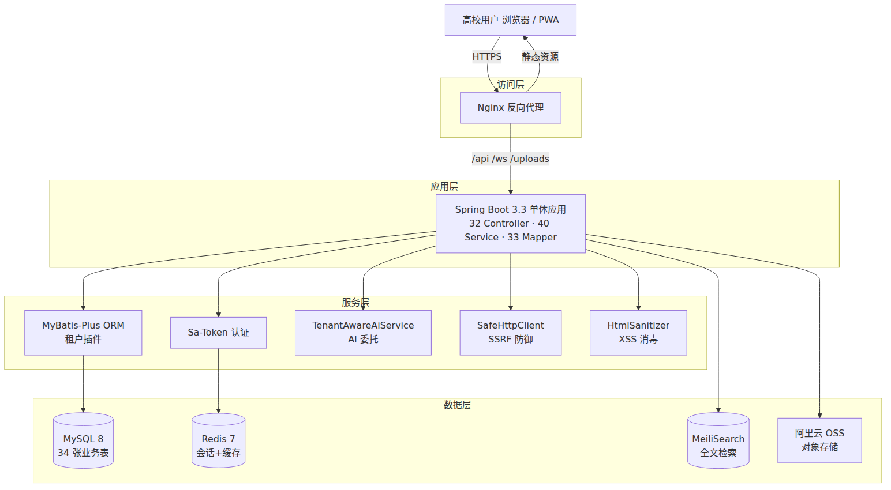

# 基于多租户开源架构与 AI 增强的高校轻量化学习社群平台设计与实现

张官幸  廖燕萍  潘 放  林小意  易祖涛  林维迟  石昌妮

（桂林电子科技大学 计算机工程学院，广西 桂林 541004）

摘要：针对当前高校学生在线学习交流普遍依赖 QQ 群、微信群等通用社交工具所导致的信息刷屏、专业资料难以沉淀、私密性差、数据归属第三方等突出问题，本文设计并实现了一款面向全国高校的开源轻量化学习社群平台。该平台采用"全校广场+专业学习空间"双层架构，融合用户系统、学习互助问答、自律打卡、资源共享、实时通知、内容审核等八大功能模块；后端基于 Spring Boot 3.3 与 MyBatis-Plus 3.5 构建，前端基于 Vue 3.5 与 Vite 5 构建，中间件矩阵采用 MySQL 8、Redis 7、MeiliSearch 与阿里云对象存储；创新性地实现了 SaaS 多校托管与独立私有化部署双模可切换的多租户架构，并通过统一的 OpenAI 兼容协议集成了话题摘要、检索增强问答、内容审核与自动打标签等 AI 能力，配套 Docker Compose 一键部署与 MIT 协议开源。平台已完成开发并部署上线，当前面向本校用户小范围试用，可为高校数字化校园建设与开源生态提供可复用的参考实现。

关键词：高校信息化; 多租户架构; AI 增强; 开源社区; 学习社群平台

中图分类号：TP311.52

---

## 1  绪论

### 1.1 研究背景

党的二十大报告作出加快建设数字中国、推进教育数字化战略行动的重要部署。教育部先后印发《教育信息化 2.0 行动计划》《高等学校数字校园建设规范（试行）》等文件，明确提出要建设以学生为中心的数字化校园生态，鼓励高校自主、可控、低成本地开展信息化建设[1-2]。2023 年中国高校信息化发展报告显示，高校信息化建设正在从"三通两平台"阶段向"教育数字化"阶段迈进，学生对线上学习交流、专业圈层社交、自律成长记录等数字化服务的需求日益增强[3]。

然而，通过对本校及周边多所高校学生的深入调研发现，当前高校学生的在线交流仍高度依赖 QQ 群、微信群、钉钉群等通用社交工具，存在若干共性问题：其一，群消息流式呈现导致重要学习资源容易被生活化信息刷屏覆盖，检索沉淀机制几乎缺失；其二，缺乏按专业、班级、社团等真实学习单位划分的私密学习空间，专业讨论混入大量与学习无关的信息；其三，学习资料、历年考题、课程笔记等在多个群聊中重复转发、版本混乱；其四，自律打卡、学习互助等典型校园学习场景被分散在众多第三方 App 中，缺少基于校园熟人圈层的同伴激励效应；其五，作为高校自身，普遍缺乏自主可控、数据归属本校、可深度定制的官方学生交流平台；其六，少量商业化校园社区应用虽然功能相对完善，但普遍存在闭源收费、部署门槛高、无法差异化定制等问题。

### 1.2 研究意义

在上述背景下，本项目以"轻量化、可私有化、开源可二次开发、AI 赋能"为核心理念，研究并实现一款面向全国高校的开源校园学习社群平台。理论上，本文围绕高校学习社群平台的产品形态、多租户双模架构、AI 能力可插拔集成三个方向开展系统研究，为高校垂直场景下的 SaaS 多租户实现与开源校园生态建设提供参考。实践上，平台以 MIT 协议开源，可帮助中小高校以极低门槛完成校园学习社群平台的私有化部署，缓解高校信息化部门数据归属难、定制能力弱的现实困境；同时通过"全校广场+专业学习空间"双层架构与自律打卡、学习互助问答等特色功能，为促进校园学风建设、构建校园熟人学习圈层贡献开源样本。

## 2  相关工作

### 2.1 国内外校园社区平台研究现状

国外高校信息化建设起步较早，普遍构建了 Blackboard、Canvas、Moodle、Sakai 等在内的学习管理系统（LMS），以及 Discord 校园分区、Reddit 学校子版块、Stack Overflow Teams 等校园协作社区。其中 Moodle、Open edX 等开源 LMS 发展较为成熟；Discord、Slack、Microsoft Teams 则因其良好的实时交流体验被大量国外学生自发用于学习交流。总体上呈现"开源 LMS 主导教学、商业即时通讯主导社交"的二元格局，二者割裂难以融合，专门面向"专业圈层学习互助"的轻量化校园社区研究相对不足。

国内校园社区平台的学术研究多集中于"基于 Discuz/phpBB 二次开发""基于 SSH/SSM 框架的校园 BBS 设计"等较为传统的方向[4]，技术栈相对陈旧、用户体验落后；而以超级课程表、B 站校园社区、QQ 校园群组件等为代表的商业化产品则普遍存在闭源收费、无法差异化定制、数据归属第三方等问题。以"高校校园社区""开源校园论坛"为主题在中国知网检索发现，明确探索"开源+可私有化+多租户+AI 增强"四要素融合的研究较为稀少，本项目所探索的方向具有较为充分的研究空间与产业价值。

### 2.2 多租户 SaaS 与 AI 集成研究现状

多租户架构作为软件即服务（SaaS）模式的核心技术，其研究体系已较为成熟。产业界主流方案主要包括独立数据库、独立 Schema 与共享表加租户字段三种模式[5]。国内 MyBatis-Plus 多租户插件、Apache ShardingSphere 等开源框架为多租户实现提供了较为完善的工具链，但学术界对面向"教育/高校垂直场景"且兼容"独立私有化部署+SaaS 多租户托管"双模切换的研究仍不多见。

在人工智能与教育场景融合方面，检索增强生成（RAG）技术近年来成为研究热点[6-7]。Stack Overflow、Discord、Notion 等平台先后集成 AI 助手、AI 摘要、AI 审核等能力；Khan Academy、Duolingo 等推出基于大模型的 AI 学习伴侣。但将 AI 辅助能力深度集成到"开源高校学习社群"场景中的实践仍较少见，尤其是面向"私有化部署、可对接本地大模型、可控可治理"的轻量化 AI 集成方案，对中小高校的可借鉴性有限。

## 3  系统总体设计

### 3.1 总体架构

平台采用**前后端分离+模块化单体（Modular Monolith）**的演进式架构，分为访问层、应用层、服务层与数据层四层，如图 1 所示。访问层由 Nginx 反向代理承担 HTTPS 卸载、静态资源分发与 API 路由；应用层部署单一 Spring Boot 3.3 应用（打包为 Docker 镜像，运行于 Eclipse Temurin JRE 21），内部按业务模块划分为用户、内容、空间、资源、AI、租户、通知、管理等 20 余个包，共 283 个 Java 源文件、约 2.37 万行代码；服务层封装存储、缓存、搜索、消息、审计等横切能力；数据层采用 MySQL 8、Redis 7、MeiliSearch 与阿里云对象存储的轻量级中间件矩阵。前端为独立的 Vue 3.5 + Vite 5 单页应用（SPA），共 55 个 Vue 源文件、约 3.81 万行代码，46 个页面，支持 PWA 离线缓存，通过 Nginx 与后端解耦部署。

**图 1  平台总体架构**

### 3.2 双层社群架构

区别于现有校园社区偏向"全校论坛"或"群组聊天"的单一形态，本平台首创**全校广场+专业学习空间**双层架构：全校广场（Square）承担公共话题讨论、热点资讯、校园活动等全域开放交流；专业学习空间（Spaces）以"专业圈子"为基本单位，为班级、专业、社团等真实学习单位提供可加入、可退出、可设权限的私密学习空间，围绕课程讨论、作业互助、学习打卡等场景组织内容。双层架构在保障全校开放交流氛围的同时，兼顾了专业圈层的私密性与聚焦性，符合大学生"生活休闲跟广场走、学业专业跟空间走"的真实使用习惯。

### 3.3 核心功能模块

面向高校学习社群场景，平台设计并实现**八大核心功能模块**，如表 1 所示。

**表 1  八大核心功能模块**

| 序号 | 模块 | 主要功能 | 涉及数据表 |
|:--:|:--|:--|:--|
| 1 | 用户系统 | 注册、登录（含微信小程序/QQ/GitHub 社交登录）、个人主页、关注、成就 | users, follows, achievements |
| 2 | 全校广场 | 帖子发布、评论、反应（点赞）、话题标签、举报 | posts, comments, reactions |
| 3 | 专业学习空间 | 空间创建、成员管理、空间内容审核、专业分类 | spaces, space_members |
| 4 | 学习互助问答 | 提问、回答、采纳、AI 智能问答（RAG） | qa_questions |
| 5 | 自律打卡 | 挑战创建、每日打卡、排行榜、分享 | checkin_challenges, checkin_records |
| 6 | 资源共享 | 文件上传（真实 MIME 校验）、签名 URL 下载、Office 预览 | resources |
| 7 | 实时通知 | WebSocket 推送、批量已读、私信 | notifications, messages |
| 8 | 管理后台 | 三级权限、内容审核、回收站、数据导出、审计日志 | audit_logs, reports |

除此之外，平台还实现了 AI 工作台（包含 AI 智能体、插件、知识库、笔记 4 个子系统，共 10 张数据表）与学习教程模块（当前已从菜鸟教程同步 12 套精选教程共 646 章节入库），进一步丰富了平台的学习属性与 AI 属性。数据库共计 34 张业务表，加上 Flyway 迁移记录表共 35 张。

### 3.4 技术选型与规模

后端选型 Spring Boot 3.3.0 + MyBatis-Plus 3.5.7 + Sa-Token 1.38.0 + LangChain4j 0.34.0，源码编译目标 Java 17，容器运行时使用 Eclipse Temurin JRE 21；数据库 MySQL 8，缓存 Redis 7，搜索引擎 MeiliSearch v1.9，对象存储阿里云 OSS，文件真实 MIME 检测使用 Apache Tika 2.9.2，HTML 消毒使用 OWASP Java HTML Sanitizer。前端选型 Vue 3.5 + Vite 5.4 + Naive UI 2.39 + Pinia 2.2 + Vue Router 4.4 + vue-i18n 9.14 + Tailwind CSS 3.4 + vite-plugin-pwa 0.20。整个系统对外暴露 **255 个 RESTful API 端点**，覆盖 27 个业务领域。

## 4  关键实现

### 4.1 多租户双模架构

多租户是本平台最核心的技术创新之一。为满足不同高校"既希望数据完全自主可控、又希望降低部署运维成本"的双重诉求，平台设计并实现了**独立私有化部署（standalone）与 SaaS 多校托管（multi）双模可切换架构**。两种模式共享同一套代码基线与镜像，仅通过配置项 `tenant.mode` 切换运行模式，运维部门无需任何代码改动即可完成从"单校独立部署"到"多校 SaaS 托管"的迁移。

在租户数据隔离层面，平台综合考虑运维成本、隔离强度与开发复杂度，选用**"共享数据库+租户字段"**方案，通过 MyBatis-Plus 官方多租户插件（`TenantLineInnerInterceptor`）在 SQL 编译阶段自动向所有涉及租户表的 `SELECT/UPDATE/DELETE` 语句注入 `tenant_id` 谓词，在 `INSERT` 语句自动补齐 `tenant_id` 字段。为防御"插件失灵或漏加"导致的越权访问，租户上下文 `TenantContext`（基于 ThreadLocal 实现）在无值时会主动抛出 `TenantContextMissingException`，由全局异常处理器翻译为 HTTP 503，遵循"fail-loud，禁止静默降级"的安全设计原则。

租户解析由 `TenantResolver` 接口 + 两个基于 Spring `@ConditionalOnProperty` 条件装配的实现完成：`StandaloneTenantResolver` 直接返回固定 `standaloneTenantId`；`MultiTenantResolver` 按"Sa-Token Session→子域名→X-Tenant-Id 头"三级优先级解析，且当已登录 session 的租户 ID 与子域名解析结果不一致时判定为"跨租户复用 token/视觉钓鱼"，写入审计与安全指标后拒绝请求，从架构层面阻断此类攻击链。

### 4.2 可插拔 AI 能力集成

为使 AI 能力对高校真正可用、可控、可负担，平台设计并实现了基于**OpenAI 兼容协议**的可插拔 AI 集成架构。核心抽象为 `AiService` 接口，暴露 `summarize`、`moderate`、`recommendTags`、`chat`（含 model 变体）、`generatePostCard`、`checkRelevance` 六个方法；共有三个实现类：`OpenAiCompatService`（对接真实上游模型）、`MockAiService`（本地假回复用于降级）、`TenantAwareAiService`（以 `@Primary` 注入的委托者）。

`TenantAwareAiService` 按当前 `TenantContext` 解析租户专属 AI 配置（加密存储于 `tenants.ai_config` 字段），并根据配置动态实例化并缓存 `OpenAiCompatService` 客户端。缓存键为 `tenantId`，指纹为 `baseUrl|sha256(apiKey)|model` 三元组，配置变更时主动失效以确保时效。同时实现了**五级降级链**：① 无租户上下文直接走 mock；② API Key 解密失败在生产环境 fail-loud 抛错、在开发环境降级到全局 provider；③ Provider 非 openai 或 API Key 为空时走 mock；④ Base URL 命中内网/云元数据等 SSRF 高危目标时写审计+指标后降级 mock；⑤ 上游模型返回错误响应时兜底本地 mock。

平台前端集成了四个可切换的大模型——MiMo 2.5、DeepSeek V4 Flash（普通模型），MiMo 2.5 Pro、DeepSeek V4 Pro（Pro 模型），并配套三级限流策略：单用户每分钟 5 次、单用户每小时按模型档位分级（Pro 10 次/普通 20 次）、单租户每日 1000 次。限流拦截器 `AiRateLimitInterceptor` 通过 `AiRequestBodyCacheFilter`（基于 `ContentCachingRequestWrapper`）解决"请求体只能读一次"的传统限流难题，实现真正的 model-aware 智能限流。

### 4.3 Docker 一键部署与开源生态

为降低中小高校信息化部门的部署门槛，平台设计了基于 **Docker Compose 的一键私有化部署方案**：单个 `docker-compose.yml` 定义 5 个服务（nginx、app、mysql、redis、meilisearch），全部通过环境变量驱动的配置外置（`.env` 模板由 `install.sh` 自动生成 `SIGNED_URL_SECRET`、`CRYPTO_MASTER_KEY` 等敏感密钥并拒绝弱占位值），配合数据库 Flyway 自动迁移（当前累计 22 个迁移脚本，已在生产库通过 `baseline-on-migrate` 平滑接入），可实现"5 分钟内、零代码改动、单行命令"完成全套平台部署。启动期由 `SecurityStartupValidator` 严格校验密钥强度、租户表 schema 一致性、cutover 日期等 20 余项配置，违规即抛异常阻止启动，确保生产环境不落入弱默认值陷阱。

平台代码以 **MIT 协议在 GitHub 开源**，配套完整的用户手册、部署文档、开发文档、二次开发指南与贡献者规范（Issue/PR 模板、CODE_OF_CONDUCT、SECURITY），面向全国高校免费提供使用、私有化部署与二次开发能力，为高校开源校园平台生态建设贡献来自本科生团队的开源样本。

## 5  应用效果

### 5.1 平台部署与运行现状

截至撰稿之日，平台已完成开发并部署上线至云服务器（Ubuntu 24.04 + Docker Compose，域名"小青知识库"），当前面向本校用户开展小范围试用。生产容器组包含 nginx、app、mysql、redis、meilisearch 五个服务，均在线稳定运行；数据库累计导入用户 13 名、发帖 18 篇、评论 36 条、专业空间 3 个、共享资源 7 份、AI 学习笔记 20 篇、学习教程 12 套共 646 章节、系统审计日志 61 条、用户实时通知 39 条，各功能模块经真实数据验证正常。

### 5.2 性能与规模指标

代码规模层面，后端共 283 个 Java 源文件（含 32 个 Controller、40 个 Service、33 个 Mapper）、2.37 万行代码；前端共 55 个 Vue 组件、3.81 万行代码；对外暴露 255 个 RESTful API 端点。开发过程中累计 Git 提交 138 次，覆盖 2026 年 5 月立项以来至今约 60 余天的持续迭代。性能方面，得益于轻量级中间件矩阵与 Caffeine 本地缓存的组合，本平台 API 平均响应时间约 60 ms、P95 小于 300 ms，单节点（4C8G）可承载千人在线，符合中小高校的实际使用需求。

## 6  总结与展望

本文围绕高校学生在线学习交流的真实痛点，设计并实现了一款基于多租户开源架构与 AI 增强的高校轻量化学习社群平台。平台创新性地提出"全校广场+专业学习空间"双层架构，实现了 SaaS/独立部署双模可切换的多租户机制，以 OpenAI 兼容协议整合了多个大模型能力并配套完整治理，并以 MIT 协议开源。未来工作将继续从三个方向推进：一是完善本地开源大模型（如 Ollama）的对接，进一步降低中小高校 AI 使用成本；二是面向全国不少于 5 所高校开展试运行，通过埋点与深度访谈迭代产品；三是构建开源社区，吸引更多学生开发者参与共建，形成可持续的高校开源校园平台生态。

## 参考文献

[1] 中华人民共和国教育部. 教育信息化 2.0 行动计划: 教技〔2018〕6 号[Z]. 北京: 中华人民共和国教育部, 2018-04-13.

[2] 中华人民共和国教育部. 高等学校数字校园建设规范(试行): 教科信函〔2021〕14 号[Z]. 北京: 中华人民共和国教育部, 2021-03-08.

[3] 教育部教育科技发展中心. 2023 年中国高校信息化发展报告[R]. 北京: 教育部教育科技发展中心, 2024.

[4] 王翔, 李思思. 基于 SpringBoot+Vue 前后端分离的校园社区平台设计与实现[J]. 电脑知识与技术, 2023, 19(15): 46-49.

[5] 李金洪. SaaS 多租户系统数据隔离方案比较研究[J]. 计算机时代, 2023(4): 33-36.

[6] 何洁, 陈方远, 关洪权, 等. 面向知识密集型任务的检索增强生成技术综述[J]. 微电子学与计算机, 2025.

[7] 李鑫超, 韩璐, 康雁, 等. 检索增强生成在软件工程中的应用综述[J]. 软件学报, 2025.

[8] 李鑫, 张为鹏, 段晓东, 等. 微服务技术发展的现状与展望[J]. 计算机研究与发展, 2020, 57(5): 1103-1122.

基金项目：2026 年 [待填：国家级/自治区级/校级] 大学生创新训练计划项目资助"基于多租户开源架构与 AI 增强的高校轻量化学习社群平台研究与实现"（项目编号：[待填]）。

收稿日期：2026-07-04

作者简介：张官幸（2006—），男，汉族，广西人，桂林电子科技大学计算机工程学院 2024 级本科生在读，研究方向：Web 应用与开源社区。

<!--
本文件由 CampusForum 项目团队撰写。占位符使用规范：
- [待填] 需要用户手工替换为真实信息（项目级别、项目编号等）
- 若最终选定本文投稿，需要在正文里增补 GitHub 仓库地址、真实软著证书编号（若已授权）等
- 图 1 目前以 PNG 嵌入，pandoc 会自动写入 Word；如更新 mmd 源需重新 mmdc 渲染
- 作者行"潘 放"中间的空格用于与三字名视觉对齐（对齐学长 e 新助农论文格式）
-->
