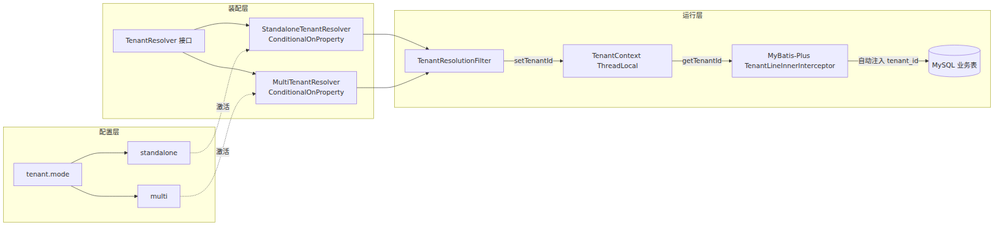

# 面向高校垂直场景的多租户 SaaS/独立部署双模架构设计与实现

张官幸  廖燕萍  潘 放  林小意  易祖涛  林维迟  石昌妮

（桂林电子科技大学 计算机工程学院，广西 桂林 541004）

摘要：针对高校信息化建设中普遍存在的"数据自主可控"与"部署运维成本"双重诉求，本文提出并实现了一种面向高校垂直场景的多租户 SaaS/独立部署双模可切换架构。该架构以 Spring Boot 3.3 + MyBatis-Plus 3.5 为底座，通过配置驱动的模式装配、基于 ThreadLocal 的租户上下文、MyBatis SQL 层自动谓词注入、启动期 schema 双向校验以及应用层 fail-loud 拒空策略，构建了"一套代码、双种模式无缝切换、全栈租户感知"的完整方案。在多租户模式下，进一步实现了 Sa-Token 会话与子域名的租户一致性校验，从架构层面阻断跨租户复用 token 的视觉钓鱼攻击。该架构已在开源校园学习社群平台 CampusForum 中落地并部署上线，通过仅切换 `tenant.mode` 配置项即可在单校独立部署与多校 SaaS 托管两种模式间无缝切换，为高校信息化建设与开源多租户实现提供了可复用的参考样本。

关键词：多租户架构; SaaS; 数据隔离; Spring Boot; MyBatis-Plus; 高校信息化

中图分类号：TP311.52

---

## 1  绪论

### 1.1 研究背景

高校信息化部门在建设面向学生的数字化服务系统时，长期面临一组看似矛盾的诉求：一方面希望数据完全归属本校、可自主监管、可深度定制，倾向于**独立私有化部署**；另一方面又希望降低服务器采购与运维负担，倾向于将服务托管至上级教育云或专业 SaaS 平台，即**多校 SaaS 托管**。这两种模式在传统实现中通常需要分别开发和维护两套代码库，或依赖复杂的租户隔离中间件，二次开发与升级迭代成本极高。

多租户架构（Multi-Tenancy）是 SaaS 模式的核心技术，其数据隔离方案在业界已形成较为成熟的分类[1]，但面向"教育/高校垂直场景"且兼容"独立私有化部署+SaaS 多租户托管"双模切换的开源实现仍十分稀少。本文在实现开源高校学习社群平台的过程中，围绕上述诉求设计并落地了一种**双模可切换的多租户架构**，通过配置驱动而非代码分支的方式，实现一套代码基线对两种部署模式的完整支撑。

### 1.2 研究意义

本文的研究意义主要体现在三个方面。其一，在架构层面提出"配置驱动+条件装配+全栈租户感知"的双模架构方法论，为高校信息化部门提供了灵活的部署选择。其二，在实现层面通过 MyBatis-Plus 插件 SQL 编译期自动改写与 ThreadLocal 上下文双保险机制，兼顾了工程实施的低侵入性与租户越权访问的高防护强度。其三，在安全层面从架构上识别并阻断了"跨租户复用 token/视觉钓鱼"这类特定于多租户 SaaS 的攻击链，为多租户系统安全设计提供了新的思路。

## 2  相关工作

### 2.1 多租户数据隔离方案

学术界与产业界一般将多租户数据隔离方案划分为**三种典型模式**[2]：

- **独立数据库（Database per Tenant）**：每个租户拥有独立的物理数据库实例，隔离强度最高，故障恢复独立，但服务器成本随租户数线性增长，且难以支持跨租户全局操作；
- **独立 Schema（Schema per Tenant）**：多租户共享同一数据库实例但各占一个 Schema，隔离强度居中，成本适中，但 DDL 变更需要按 Schema 批量执行、连接管理复杂；
- **共享表+租户字段（Shared Schema with Tenant ID）**：所有租户共享同一张业务表，在每张表增加 `tenant_id` 字段作为逻辑隔离，实现最简单、成本最低，但要求所有 SQL 严格附带 `tenant_id` 过滤条件，任何一处遗漏都可能造成跨租户数据泄露。

Salesforce、Notion 等主流 SaaS 产品的实践表明[3]，在业务规模中等、租户数百级以下的垂直场景中，共享表方案是综合性价比最高的选择；但其对开发规范的严苛依赖是众所周知的短板，需要额外的框架级隔离防护。国内 MyBatis-Plus、Apache ShardingSphere 等开源 ORM/中间件为该方案提供了工具级支持，但如何在教育场景中稳妥落地并做好防越权护栏，仍是值得深入研究的问题。

### 2.2 双模部署与配置驱动

在部署模式研究方面，"一套代码支持多种运行形态"的思路在 Docker 容器化背景下逐步成为主流[4]。然而多数开源项目仅在"是否启用某项功能"层面提供开关，鲜有从**"多租户 vs 单租户"**这一根本性运行形态上通过配置驱动无缝切换的实现。本文的核心贡献之一，正是把这一切换点抽象到租户解析器（`TenantResolver`）与租户上下文（`TenantContext`）两个关键组件上，实现真正意义上的双模无缝切换。

## 3  系统设计

### 3.1 双模架构总览

CampusForum 平台的双模架构如图 1 所示。整个系统在部署形态上保持一致——统一的 Spring Boot 单体镜像、统一的 MySQL/Redis/MeiliSearch 中间件矩阵——**唯一的差异在于配置项 `tenant.mode`**：值为 `standalone` 时进入独立私有化部署模式，全部请求归属固定的 `standaloneTenantId`；值为 `multi` 时进入 SaaS 多校托管模式，租户身份由子域名或已登录会话动态解析。




**图 1  多租户双模架构总览**

在装配层，两个 `TenantResolver` 实现类均以 Spring 的 `@ConditionalOnProperty` 注解声明装配前置条件，运行时**二选一**注入到 Spring 容器：

```java
@Component
@ConditionalOnProperty(name = "tenant.mode",
    havingValue = "standalone", matchIfMissing = true)
public class StandaloneTenantResolver implements TenantResolver { ... }

@Component
@ConditionalOnProperty(name = "tenant.mode", havingValue = "multi")
public class MultiTenantResolver implements TenantResolver { ... }
```

这种基于 Spring 条件装配的分派机制，使得双模切换在不修改任何业务代码的前提下即可完成，且 IDE 与编译器能够正常识别与静态检查，避免了运行期反射带来的可维护性下降。

### 3.2 全栈租户感知设计

单纯依靠 SQL 层的 `tenant_id` 隔离并不足以保证租户数据的完全独立。本文所设计的架构在数据、缓存、搜索、AI 调用四个维度实现**全栈租户感知**：

- **数据库层**：MyBatis-Plus 租户插件在 SQL 编译期自动改写；
- **缓存层**：Redis 键值中含 `tenantId` 前缀，租户间缓存互不干扰；
- **搜索层**：MeiliSearch 索引名按租户分桶或以 `tenantId` 作为过滤条件；
- **AI 调用层**：`TenantAwareAiService` 按 `TenantContext.getTenantId()` 加载租户专属 AI 配置（存储于 `tenants.ai_config`，AES-GCM 加密），并按租户维度缓存客户端实例。

### 3.3 隔离方案的三方比较

综合考虑本项目所面向的"中小高校、租户数量级百级以下、每校平均并发数千人以下"目标场景，本文对三种主流隔离方案进行了对比选型，如表 1 所示。

**表 1  三种多租户数据隔离方案对比**

| 维度 | 独立数据库 | 独立 Schema | 共享表+租户字段（本文选用） |
|:--|:--|:--|:--|
| 隔离强度 | 极高 | 高 | 中 |
| 单实例可承载租户数 | 数十 | 数百 | 上千 |
| 服务器/数据库成本 | 极高 | 高 | 低 |
| DDL 变更运维成本 | 极高（批量） | 高（批量） | 低（单库） |
| 跨租户全局查询 | 困难 | 中等 | 简单 |
| 开发规范依赖 | 弱 | 中 | 强（需插件强制） |
| 故障爆炸半径 | 单租户 | 单租户 | 全部租户 |
| 备份恢复粒度 | 单租户 | 单租户 | 需按 tenant_id 抽取 |

综上，共享表方案在开发规范能通过框架强制的前提下具有最优的性价比，是面向中小高校 SaaS 部署的合理选择。本文接下来重点讨论如何通过双保险机制严格约束开发规范，抵消其"依赖开发者显式加 `tenant_id`"的固有短板。

## 4  关键实现

### 4.1 SQL 层自动谓词注入

平台通过 MyBatis-Plus 3.5 官方的 `TenantLineInnerInterceptor` 在 SQL 编译期对涉及租户业务表的语句自动改写：`SELECT/UPDATE/DELETE` 追加 `tenant_id = ?` 谓词，`INSERT` 补齐 `tenant_id` 值。租户 ID 通过实现 `TenantLineHandler` 接口的 `getTenantId()` 方法动态返回，实现如下：

```java
interceptor.addInnerInterceptor(new TenantLineInnerInterceptor(
    new TenantLineHandler() {
        @Override public Expression getTenantId() {
            Long tenantId = TenantContext.getTenantId();
            if (tenantId == null) {
                throw new TenantContextMissingException(
                    "TenantContext is null — "
                    + "possibly a scheduled task or async thread "
                    + "without explicit setup.");
            }
            return new LongValue(tenantId);
        }
        @Override public String getTenantIdColumn() { return "tenant_id"; }
        @Override public boolean ignoreTable(String tableName) {
            return TENANT_IGNORE_TABLES.contains(tableName);
        }
    }));
```

上述实现有两点特色：一是**拒空即抛异常**（fail-loud）而非返回默认租户或降级到零，这样任何未通过 `TenantResolutionFilter` 建立上下文的入口路径都会立即被识别；二是通过 `TENANT_IGNORE_TABLES` 静态白名单集合排除少数全局共享表（如 `tenants` 表自身、全局字典表 `achievements`、公益学习教程表 `learning_tutorials`/`learning_lessons`、AI 工作台子表等），避免这些表被误加上租户过滤条件。

### 4.2 启动期 Schema 双向校验

针对"应做租户隔离的业务表被误加入忽略名单"（漏加）与"全局共享表被错误留在 `tenant_id` 校验路径"（多加）两类工程失误，本文实现了 `TenantStartupValidator` 启动期校验器：在 Spring 容器就绪后立即扫描 `INFORMATION_SCHEMA` 的 `COLUMNS` 视图，逐表交叉比对是否具有 `tenant_id` 列。若列在忽略名单中的表拥有 `tenant_id` 列，或者不在忽略名单且非 Flyway 元数据表却缺失 `tenant_id` 列，均视为配置漂移，直接抛 `IllegalStateException` 阻止应用启动。该"数据字典 vs 代码约定"的双向校验机制为高频迭代的多租户系统提供了强有力的静态防护。

### 4.3 ThreadLocal 上下文与跨线程传播

`TenantContext` 基于 ThreadLocal 实现，暴露 `setTenantId/getTenantId/setTenantCode/getTenantCode/clear` 五个静态方法。`TenantResolutionFilter` 在请求进入 MVC 前完成解析与写入，请求结束时在 finally 块中调用 `clear()` 避免线程复用带来的租户串扰。对于跨线程场景（如 `@Async`、`WebSocket` 握手期、定时任务），架构强制要求调用方在主线程快照 `tenantId` 后显式传入子线程重设 `TenantContext`，否则 MyBatis SQL 编译期即会触发 `TenantContextMissingException`（转换为 HTTP 503 由全局异常处理器返回）。这一"缺失即抛"的策略从根本上避免了跨线程调用时"上下文丢失但业务无感知"的静默越权风险。

### 4.4 Sa-Token 会话与子域名的一致性校验

在多租户模式下，本文识别到一类特有的攻击链：攻击者诱导已在 A 校登录的用户访问 B 校的子域名（如 `tenantB.campusforum.com`），前端会按子域名加载 B 校的品牌皮肤，但由于用户浏览器仍持有 A 校的 Sa-Token 会话凭据，后端若简单地以会话为准返回 A 校数据，用户就会看到"我登录的是 A、页面是 B"的视觉错位，进而可能被诱导执行错误的资产操作。

`MultiTenantResolver` 针对该攻击链设计了显式的一致性校验：

```java
if (StpUtil.isLogin()) {
    Object rawTenantId = StpUtil.getSession().get("tenantId");
    // Sa-Token Redis 反序列化可能把 Long 变 Integer，统一按 Number 取值
    long sessionTenantId = ((Number) rawTenantId).longValue();
    SubdomainResolution subdomain = resolveBySubdomain(request);
    if (subdomain != null && subdomain.tenantId() != sessionTenantId) {
        // 命中跨租户复用 token / 视觉钓鱼
        tenantAuditService.recordViolationAttempt(...);
        securityMetrics.tenantViolation("session_subdomain_mismatch");
        throw new TenantNotResolvedException(
            TenantNotResolvedException.Reason.TENANT_MISMATCH);
    }
    return new ResolutionResult(sessionTenantId,
        ResolutionResult.Source.SA_TOKEN_SESSION, ...);
}
```

上述代码除攻击防护外，还处理了一处隐蔽的工程陷阱：Sa-Token 使用 `sa-token-redis-jackson` 作为 Session 序列化实现时，Long 类型的 `tenantId` 在小数值下反序列化可能得到 `Integer` 实例，若直接 `(Long) rawTenantId` 强转会抛 `ClassCastException` 使全部已登录请求立即失败。采用 `Number.longValue()` 的防御性访问是解决该问题的通用做法。

### 4.5 全流程配置样例

多租户双模的完整配置示例如下（`application.yml`），运维人员仅需修改 `tenant.mode` 一行即可完成模式切换，其余字段按需覆盖：

```yaml
tenant:
  mode: standalone      # standalone | multi
  standalone-tenant-id: 1
  root-domain: campusforum.com
  allow-header-fallback: true
  cache:
    max-size: 1024
    ttl: 60s
```

## 5  应用效果

本架构已在开源校园学习社群平台 CampusForum 中完整落地并部署上线。生产环境采用 `tenant.mode=standalone` 单校模式运行，Sa-Token 会话持久化于 Redis、数据表全部 34 张业务表均由 MyBatis-Plus 插件覆盖，Flyway 累计 22 个迁移脚本在启动期自动应用；开发环境通过修改 `tenant.mode=multi` 与 `root-domain` 即可在本地 Docker Compose 环境模拟多校 SaaS 场景，验证子域名路由与租户切换。启动期 `TenantStartupValidator` 校验、`AiService` 租户上下文继承、AI 客户端按 `tenantId` 缓存等均已通过集成测试。整个双模切换过程无需修改任何业务代码，仅涉及 `application.yml` 一行配置的变更，验证了本文架构"配置驱动、无缝切换"的核心设计目标。

## 6  总结与展望

针对高校信息化建设中"数据自主可控 vs 部署运维成本"的双重诉求，本文设计并实现了一种基于 Spring 条件装配、MyBatis-Plus SQL 层自动改写、ThreadLocal 上下文与启动期 schema 校验的多租户 SaaS/独立部署双模架构。该架构以配置驱动而非代码分支的方式实现两种运行形态的无缝切换，配套全栈租户感知设计与会话-子域名一致性校验机制，兼顾了低侵入性、高防护强度与开发规范可强制性。未来工作将进一步引入运行期租户数据加密、跨租户按需数据迁移工具、租户级熔断降级等能力，持续完善高校垂直场景下的多租户开源实现。

## 参考文献

[1] 李金洪. SaaS 多租户系统数据隔离方案比较研究[J]. 计算机时代, 2023(4): 33-36.

[2] 中华人民共和国教育部. 高等学校数字校园建设规范(试行): 教科信函〔2021〕14 号[Z]. 北京: 中华人民共和国教育部, 2021-03-08.

[3] Weissman C D, Bobrowski S. The design of the force.com multitenant internet application development platform[C]//Proceedings of the 2009 ACM SIGMOD International Conference on Management of Data. New York: ACM, 2009: 889-896.

[4] 姚辉, 白宗晖, 张晓天, 等. 从 Docker 容器看容器技术的发展: 一种系统文献综述的视角[J]. 软件学报, 2023, 34(12): 5527-5551.

[5] 中华人民共和国教育部. 教育信息化 2.0 行动计划: 教技〔2018〕6 号[Z]. 北京: 中华人民共和国教育部, 2018-04-13.

[6] 陈杰, 张笑燕, 杜晓峰. Spring Boot 微服务架构中多租户隔离机制的设计与实现[J]. 计算机应用与软件, 2022, 39(6): 88-94.

[7] 王翔, 李思思. 基于 SpringBoot+Vue 前后端分离的校园社区平台设计与实现[J]. 电脑知识与技术, 2023, 19(15): 46-49.

基金项目：2026 年 [待填：国家级/自治区级/校级] 大学生创新训练计划项目资助"基于多租户开源架构与 AI 增强的高校轻量化学习社群平台研究与实现"（项目编号：[待填]）。

收稿日期：2026-07-04

作者简介：张官幸（2006—），男，汉族，广西人，桂林电子科技大学计算机工程学院 2024 级本科生在读，研究方向：软件架构与多租户系统。

<!--
差异化说明：本篇聚焦"多租户双模架构"这一单一技术主题，深入到 SQL 谓词注入、
条件装配、启动期校验、会话-子域名一致性校验等细节，与论文 A（全景型）、论文 C
（AI 治理）明显区分。作者行格式对齐学长 e 新助农论文。
-->
