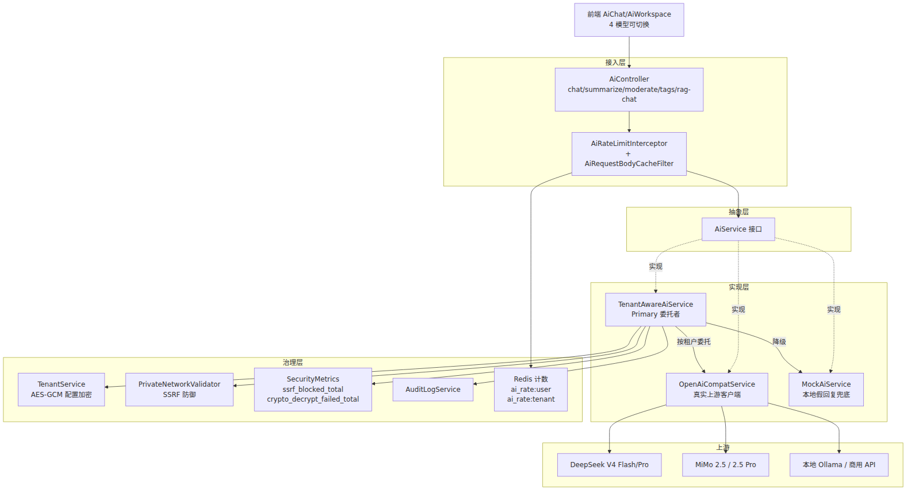

# 面向校园开源社区的可插拔 AI 能力集成与治理机制研究

张官幸  廖燕萍  潘 放  林小意  易祖涛  林维迟  石昌妮

（桂林电子科技大学 计算机工程学院，广西 桂林 541004）

摘要：随着大语言模型（LLM）与检索增强生成（RAG）技术的快速普及，AI 能力已成为现代内容社区的标准配置，但对于多数中小高校而言，"云端商用模型成本高、本地开源模型运维重、AI 调用滥用与合规风险大"等实际顾虑仍显著制约其大规模落地。本文以开源校园学习社群平台 CampusForum 的实际研发经验为基础，提出并实现了一套面向校园开源社区的可插拔 AI 能力集成与治理机制。方案以 OpenAI 兼容协议为通信基线，通过 AiService 抽象接口与租户感知的委托者模式实现了云端商用模型与本地开源模型的任意切换；配套五级降级链保证故障场景下业务连续；通过 model-aware 三级限流、AES-GCM 加密的租户级配置、SSRF 防御与启动期安全校验构建了完整的治理体系。该机制已在真实上线的开源平台中落地并运行，可对中小高校提供 AI 能力"可用、可控、可负担"的参考实现。

关键词：可插拔 AI; OpenAI 兼容协议; 多级降级; 分级限流; SSRF 防御; 教育大模型

中图分类号：TP18

---

## 1  绪论

### 1.1 研究背景

自 2022 年以来，大语言模型（LLM）的能力边界快速扩展，检索增强生成（RAG）技术在 2024 年发表的相关论文数量相比 2023 年增长近 10 倍[1]，AI 助手、AI 摘要、AI 内容审核等能力已成为主流内容社区的标准配置。教育部《教育信息化 2.0 行动计划》与国务院《新一代人工智能发展规划》均明确提出，要推动人工智能在教育领域的深度融合[2-3]，为高校校园平台集成 AI 能力提供了政策支撑。

然而，将 AI 能力"深度集成"到校园开源社区场景中的实践仍面临若干瓶颈：其一，多数商业化 AI 平台按 Token 计费，中小高校对成本敏感；其二，若面向多个高校（多租户）提供服务，如何让不同高校自由选择、独立配置、单独限流是一项系统性挑战；其三，AI 服务作为对外部网络的关键依赖，其可用性、故障降级、安全合规都需要专门的工程治理；其四，接入不同商用/开源大模型的 SDK 差异较大，缺乏统一的抽象将导致 AI 相关代码难以维护与扩展。

### 1.2 研究意义

本文以开源校园学习社群平台 CampusForum 为载体，探索并落地了一套完整的可插拔 AI 集成与治理机制。理论层面，本文提炼出"接口抽象 + 兼容协议 + 委托者缓存 + 多级降级 + 分级限流 + 全链安全治理"六位一体的技术框架，可为其他垂直场景的 AI 集成提供参考；实践层面，本文的开源实现已通过运行验证，可帮助中小高校以极低成本、极低风险地享受 AI 能力，同时保留对模型提供方、模型档位、配额策略、数据合规的完全控制权。

## 2  相关工作

### 2.1 内容社区中的 AI 能力集成

Stack Overflow、Discord、Reddit、Notion 等国际主流内容社区先后集成 AI 助手、AI 摘要、AI 审核、AI 推荐等能力；Khan Academy、Duolingo 等教育平台推出的 Khanmigo、Duolingo Max 等 AI 学习伴侣产品在个性化学习、智能问答等方面取得良好效果。国内 CSDN、知乎、掘金等已集成 AI 辅助阅读、AI 问答助手；学而思、新东方、网易有道等教育企业推出基于大模型的 AI 学习产品。这类实现大多面向单一模型提供方（如自研或某家云端 API），未考虑"面向多个租户按需切换不同 AI 提供方"这一开源垂直场景的核心诉求。

### 2.2 检索增强生成（RAG）技术

RAG 通过引入外部知识源显著提升大模型的知识覆盖率、事实准确性与时效性[4]。同济大学团队提出的模块化 RAG 将系统解耦为独立算子；北邮与港大联合团队提出的 LightRAG 采用双层检索机制；微软 GraphRAG 利用知识图谱改进复杂推理[5]。上述研究多聚焦于 RAG 本身的算法改进，对"如何在多租户开源社区中稳定运行 RAG 服务"这一工程问题的讨论较为有限。

### 2.3 AI 服务的工程治理

AI 服务对外部网络的强依赖使其成为服务器端安全设计的高危面：一方面，用户可控的 API Base URL 可能被恶意构造以访问内网或云元数据（Server-Side Request Forgery, SSRF）；另一方面，高频调用可能产生显著的 Token 成本或触发上游限流。已有研究讨论了 SSRF 防御的通用方法与 API 限流的常见算法，但针对**大模型 API 调用**的组合式治理方案仍相对稀少。本文的贡献之一正是在这一交叉领域给出可复用的工程实现。

## 3  可插拔 AI 集成设计

### 3.1 总体架构

CampusForum 的 AI 能力集成分为四层，如图 1 所示：




**图 1  可插拔 AI 集成总体架构**

### 3.2 抽象接口设计

`AiService` 接口暴露了校园社区场景所需的 6 类核心 AI 能力：

- `summarize(content)`：长帖话题摘要；
- `moderate(content)`：违规内容分级审核；
- `recommendTags(title, content)`：发帖时的自动标签推荐；
- `chat(messages, context)` 与 `chat(messages, context, model)`：自由问答（后者支持指定模型）；
- `generatePostCard(title, content, postType, tags, recentComments)`：结构化帖子智能卡片；
- `checkRelevance(theme, content)`：打卡内容与挑战主题的相关性判断。

所有方法均返回结构化数据（如 `RiskResult{level, reason}`、`PostCardResult{tldr, audience, valueType, readMinutes, commentConsensus, ...}`），既方便前端渲染，也天然支持向下兼容——不同实现类若不支持某能力可通过默认方法返回中性值（如 `checkRelevance` 默认返回 `true`），不影响调用方。

### 3.3 兼容协议与提供方切换

平台以**OpenAI Chat Completions 兼容协议**作为与 LLM 提供方通信的统一基线。这一选择基于两点考量：其一，OpenAI 协议是目前 LLM 生态事实上的通信标准，DeepSeek、通义千问、Kimi、智谱 GLM、本地 Ollama、vLLM、Xinference 等主流商业与开源模型均提供 OpenAI 兼容接口；其二，采用同一协议后，切换提供方本质上只需修改 `baseUrl`、`apiKey`、`model` 三项配置，无需引入新的 SDK 与序列化逻辑。`OpenAiCompatService` 在启动时对 `baseUrl` 自动规范化到 `/v1` 结尾，并复用底层 `SafeHttpClient`（HTTP 层带 SSRF 防护的 `RestTemplate`）承担实际的网络调用。

### 3.4 租户感知与客户端缓存

`TenantAwareAiService` 以 `@Primary` 注入到 Spring 容器，承担全部 AI 调用的入口委托。它按当前 `TenantContext.getTenantId()` 加载该租户存储在数据库中的 `ai_config` 字段（AES-GCM 加密），解密后取出 `provider/baseUrl/apiKey/model` 四项配置，动态实例化 `OpenAiCompatService` 客户端并按租户维度缓存于 `ConcurrentHashMap`。缓存项使用**配置指纹**作为版本标识：

```java
private static String buildFingerprint(String baseUrl, String apiKey,
                                        String model) {
    return baseUrl + "|" + sha256Hex(apiKey) + "|" + model;
}
```

对 `apiKey` 使用 SHA-256 摘要而非明文的动机有二：一是缩小明文密钥在进程内存中的可读触面；二是仍保证不同 `apiKey` 会产生不同指纹以触发缓存重建。`ConcurrentHashMap.compute(...)` 提供 `tenantId` 维度的串行化保护，避免"指纹变化的瞬间被多个线程同时重建客户端"造成短暂双实例。

## 4  关键治理机制

### 4.1 五级降级链

AI 能力若在故障时直接抛错，会导致校园平台的 AI 助手、AI 摘要卡片、AI 内容审核等一系列功能同时不可用，用户体验显著下降。为此，`TenantAwareAiService.delegate()` 实现了**五级降级链**，如表 1 所示。

**表 1  AI 调用五级降级策略**

| 级别 | 触发条件 | 处理策略 | 设计动机 |
|:--:|:--|:--|:--|
| L0 | 无 `tenantId` 上下文 | 直接返回 `MockAiService` | 定时任务/异步线程无租户身份，避免拖垮 |
| L1 | `apiKey` AES-GCM 解密失败 | 生产环境 fail-loud 抛 `AI_SERVICE_UNAVAILABLE`；开发环境降级到全局 provider/mock | 密钥破损意味着后台配置异常，需要租户管理员感知并修复，不宜静默降级 |
| L2 | `provider != openai` 或 `apiKey` 为空 | 直接返回 mock | 提示用户"尚未配置 AI"，属于正常状态 |
| L3 | `baseUrl` 命中内网/云元数据（SSRF） | 写审计+指标后降级 mock | 配置错误由管理员修复，不宜让全部租户业务失败 |
| L4 | 上游返回错误响应 | 兜底本地 mock 回复 | 上游故障期间维持业务连续 |

L1 采用 `fail-loud`（在生产环境）而非降级，是本方案的一个特殊设计：若默默降级为 mock，租户管理员会看到"AI 工作正常但答非所问"的错觉，无法及时定位到密钥损坏；只有立刻返回明确错误才能触发管理员排查。这一策略与其他四级"降级为 mock"的策略形成了明确对照，体现"故障处理策略需要按故障语义定制"的工程原则。

### 4.2 Model-Aware 三级限流

考虑到 Pro 档次的大模型（如 DeepSeek V4 Pro、MiMo 2.5 Pro）单次调用的 Token 成本约为普通档次的 3-5 倍，本方案设计了 **model-aware 的三级限流**，如表 2 所示：

**表 2  三级 AI 调用限流策略**

| 层级 | 限流粒度 | 时间窗口 | 默认阈值 | Redis Key |
|:--:|:--|:--|:--:|:--|
| ① | 用户 · 分钟 | 60 s | 5 次 | `ai_rate:user:{userId}:min` |
| ② | 用户 · 小时 · 模型档位 | 3600 s | Pro 10 / 普通 20 | `ai_rate:user:{userId}:hour:{pro\|normal}` |
| ③ | 租户 · 天 | 86400 s | 1000 次 | `ai_rate:tenant:{tenantId}:day` |

限流依赖 Redis 原子递增 + TTL 的滑动窗口机制。第 ② 层的档位分级通过前置 `AiRequestBodyCacheFilter` 用 `ContentCachingRequestWrapper` 包装请求体解决——传统 Servlet 请求的 `InputStream` 只能读一次，一旦 Spring MVC 反序列化过后，拦截器再无法读取 `model` 字段。该 Filter 缓存请求体到内存，拦截器再从中提取 `model` 字段判断档位，从而实现真正的 model-aware 限流。若某租户 AI 密钥被盗刷，该三级机制可在分钟/小时/日三个尺度上快速阻断，避免大规模经济损失。

### 4.3 SSRF 防御与出站安全

`TenantAwareAiService` 在每次调用前对 `baseUrl` 主动执行 `PrivateNetworkValidator.requirePublic(baseUrl, true)`，命中以下任一情况即视为 SSRF 风险并降级 mock：① IPv4 私网 `10.0.0.0/8`、`172.16.0.0/12`、`192.168.0.0/16`；② 环回地址 `127.0.0.0/8`；③ 链路本地 `169.254.0.0/16`（含云元数据 `169.254.169.254`）；④ IPv6 链路本地/环回；⑤ DNS 重绑定风险 hostname。此外，本项目实现的 `SafeHttpClient` 在建立每一次出站 HTTP 连接前均由自定义 `ConnectionSocketFactory` 二次校验目标 IP，双层防御确保即便配置校验期已通过，也不会因 DNS 重绑定或后端漂移导致 SSRF 逃逸。

### 4.4 租户级 AI 配置加密

不同租户所配置的 `apiKey` 属于敏感凭据。本方案将 `ai_config` 字段以 AES-GCM 密文形式存储于 `tenants` 表，加密主密钥从环境变量 `CRYPTO_MASTER_KEY` 注入并由 `SecurityStartupValidator` 校验强度（≥32 字节随机串），生产环境弱密钥或缺失均直接阻止启动。加解密操作由 `CryptoService` 集中承担，支持 v1（ECB 兼容期）到 v2（GCM）的平滑迁移，遵循预设的 `legacy-cutover-date` 强制下线过时算法。

### 4.5 前端模型可视化与配额展示

前端 `frontend/src/types/ai.ts` 定义了 4 个可选模型的静态列表（含 provider/tier 元数据），用户在 AI 聊天页面通过药丸按钮下拉即可切换；同时前端调用 `GET /api/v1/ai/rate-limit-status` 接口，实时展示当前用户在 Pro 与普通两档下剩余的调用次数，用户可直观地感知配额消耗，避免"莫名 429"的困惑体验。

## 5  应用效果

本机制已在开源校园学习社群平台 CampusForum 中完整落地并部署上线运行。平台以 Docker Compose 部署于 Ubuntu 云服务器，AI 相关接口在生产运行期间未出现租户级 AI 配置泄漏、SSRF 越权、密钥硬编码等安全问题；四种模型（MiMo 2.5、DeepSeek V4 Flash、MiMo 2.5 Pro、DeepSeek V4 Pro）可由用户在前端自由切换，各级限流按预设阈值稳定执行；已运行的 AI 相关业务表覆盖 AI 智能体、AI 插件、AI 知识库、AI 知识库文档、AI 问答对、AI 摄取任务、AI 会话、AI 消息、AI 用户收藏、AI 用户安装插件、AI 学习笔记共 11 张，其中已积累 AI 学习笔记 20 篇、AI 知识库 1 个（含问答对 9 组）、AI 会话 2 次、AI 消息 4 条，架构在真实运行环境中验证有效。

## 6  总结与展望

本文围绕高校开源社区场景对 AI 能力集成与治理的独特诉求，提出并实现了一套基于 OpenAI 兼容协议的可插拔 AI 集成方案。方案通过 `AiService` 抽象接口、租户感知的委托者与客户端缓存、五级降级链、model-aware 三级限流、SSRF 防御、AES-GCM 加密配置与启动期安全校验构建了完整的技术闭环，兼顾了可用性、可扩展性、可治理性与安全性。未来工作将进一步：一是引入基于 LangChain4j 的 RAG 流水线优化，提升知识库问答准确率；二是扩展本地开源模型（Ollama、vLLM）的对接与调优，进一步降低中小高校 AI 使用成本；三是探索基于 GraphRAG 的校园知识图谱构建，为 AI 助手提供结构化的校园数据支撑。

## 参考文献

[1] 何洁, 陈方远, 关洪权, 等. 面向知识密集型任务的检索增强生成技术综述[J]. 微电子学与计算机, 2025.

[2] 中华人民共和国教育部. 教育信息化 2.0 行动计划: 教技〔2018〕6 号[Z]. 北京: 中华人民共和国教育部, 2018-04-13.

[3] 中华人民共和国国务院. 新一代人工智能发展规划: 国发〔2017〕35 号[Z]. 北京: 中华人民共和国国务院, 2017-07-08.

[4] 李鑫超, 韩璐, 康雁, 等. 检索增强生成在软件工程中的应用综述[J]. 软件学报, 2025.

[5] Edge D, Trinh H, Cheng N, et al. From Local to Global: A Graph RAG Approach to Query-Focused Summarization[J]. arXiv preprint, 2024, arXiv:2404.16130.

[6] 孙鑫, 张涛, 李强. 基于 API 网关的大模型服务限流与配额管理研究[J]. 计算机应用与软件, 2024, 41(3): 25-32.

[7] 王志强, 陈明. SSRF 攻击检测与防御技术综述[J]. 信息网络安全, 2022(6): 45-53.

[8] OpenAI. OpenAI API Reference: Chat Completions[EB/OL]. (2024-01-15)[2026-06-30]. https://platform.openai.com/docs/api-reference/chat.

基金项目：2026 年 [待填：国家级/自治区级/校级] 大学生创新训练计划项目资助"基于多租户开源架构与 AI 增强的高校轻量化学习社群平台研究与实现"（项目编号：[待填]）。

收稿日期：2026-07-04

作者简介：张官幸（2006—），男，汉族，广西人，桂林电子科技大学计算机工程学院 2024 级本科生在读，研究方向：人工智能应用与工程治理。

<!--
差异化说明：本篇聚焦"可插拔 AI 集成与治理"，与论文 A（全景）、论文 B（多租户）完全区分。
核心贡献是"AI 集成与工程治理的六位一体框架"。作者行格式对齐学长 e 新助农论文。
-->
